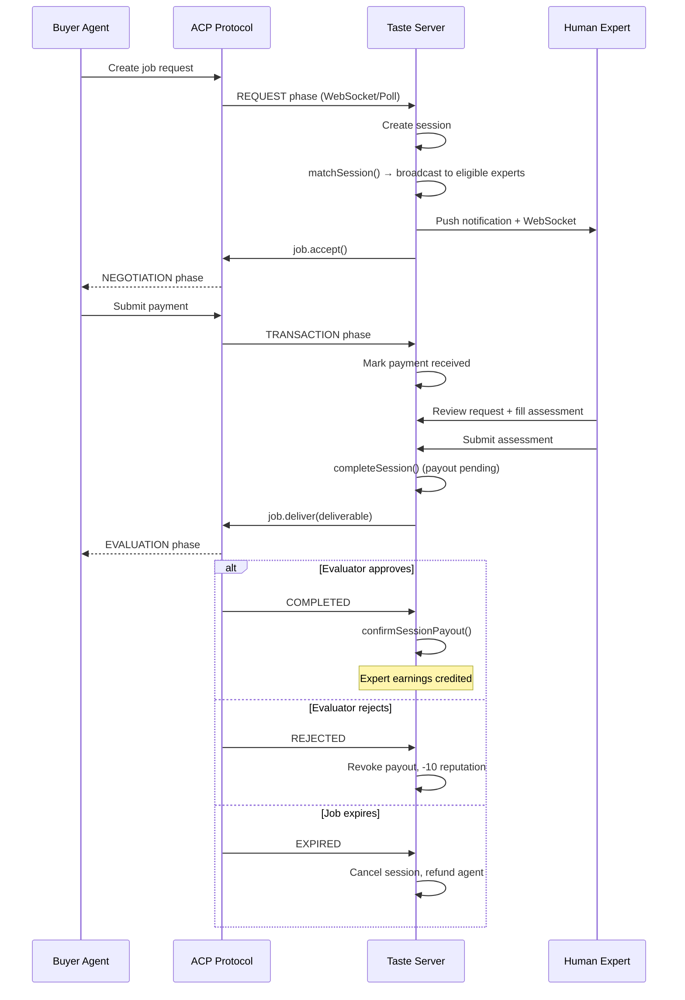
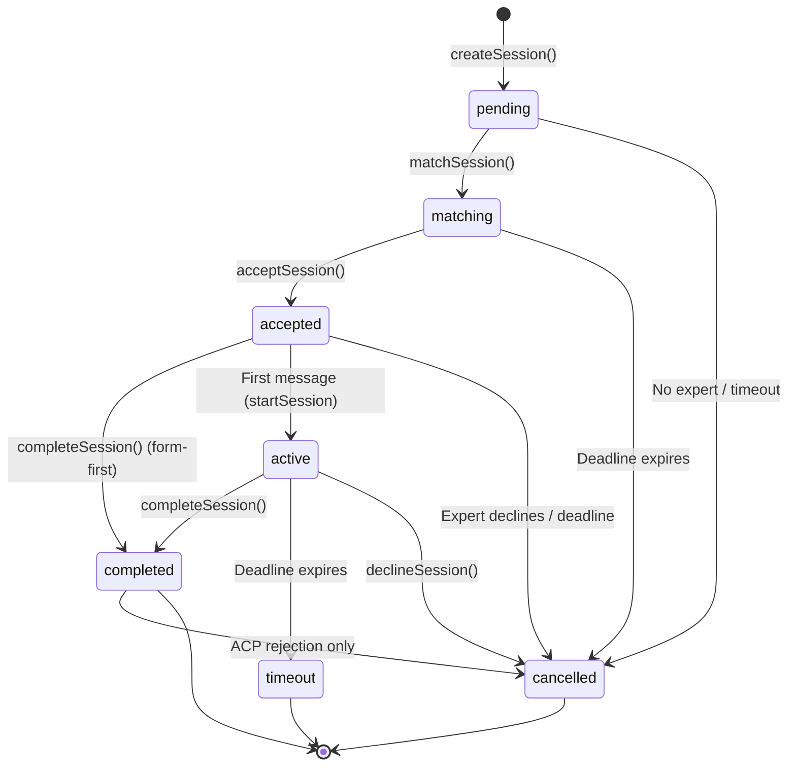
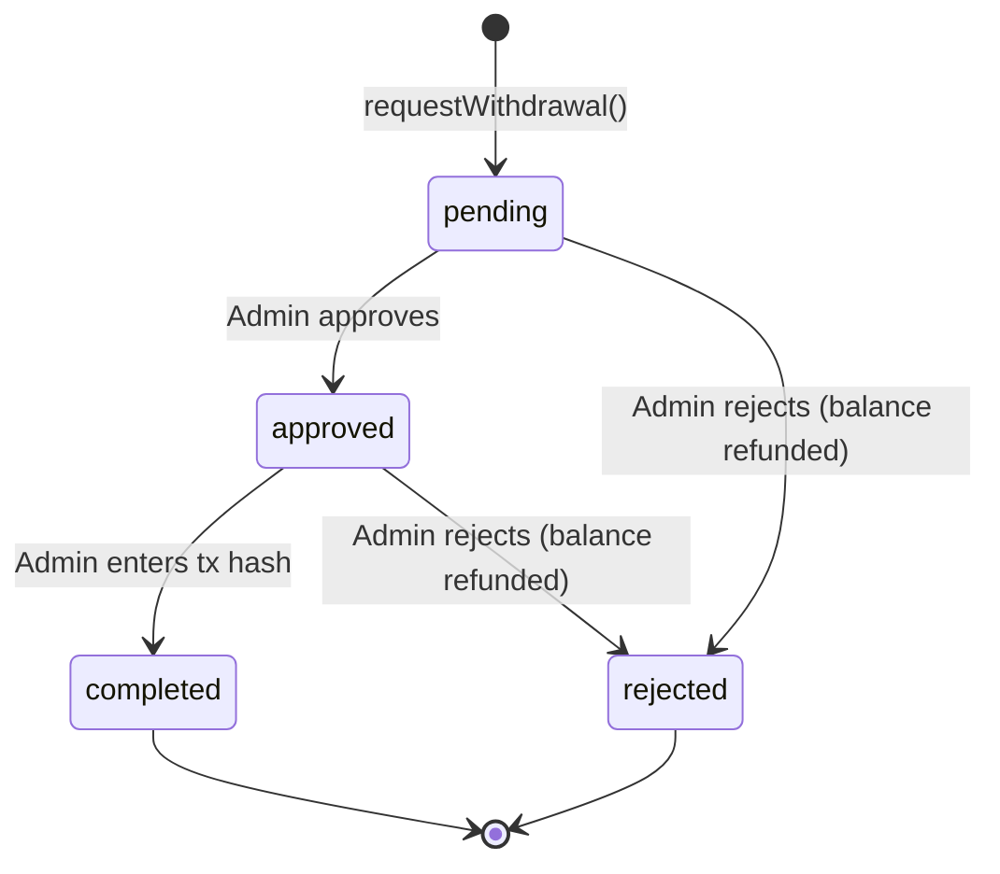

# Taste Platform — Use Cases & Flow Documentation

## System Overview

Taste is a human judgment oracle for AI agents on the Virtuals Protocol ACP (Agent Commerce Protocol) marketplace. Agents pay human experts for qualitative assessments — structured evaluations with verdicts, scores, and reasoning that agents can't produce on their own.

The expert workflow is form-first: read the agent's request, fill in a structured assessment form, submit. Optional chat messaging exists but no ACP agents currently respond to messages — the interaction model is one-shot request→review→deliver.

### Feature Availability

| Feature | API | Dashboard | Notes |
|---------|-----|-----------|-------|
| Expert matching | Active | Automatic | Triggered on session creation |
| Assessment form | Active | Active | Form-first, inline in session view |
| Chat messaging | Active | Active | Expert can send; agents don't reply in practice |
| Expert management | Active | Active | Create, view, deactivate |
| Withdrawals | Active | Active | Request, approve, reject, complete |
| Push notifications | Active | Active | 5 trigger types |
| Dispute arbitration | Active | Active | Evaluator role via ACP |
| ACP memo bridge | Active | Messages shown | Polls for agent memos, resolves off-chain content (SDK beta.37+), injects as chat messages |
| Turn limits | Active | Hidden | Tracked server-side, not displayed in UI |
| Session creation | **Disabled** | No UI | Route returns 403; implementation preserved |
| Add-ons | **Disabled** | No UI | Routes return 403; WebSocket handler disabled; implementation preserved |
| File attachments | **Disabled** | Removed from chat | Route returns 403; implementation preserved |
| Admin send-as-agent | **Disabled** | No UI | Code commented out; implementation preserved |
| Idle timeout | Schema only | No | Column exists (`idle_warned_at`) but no timer logic implemented |
| `wrapping_up` status | Schema only | No | Defined in types but never transitioned to |

---

## 1. ACP Transaction Flow (On-Chain)

The core money flow between a buyer agent and Taste via the Virtuals ACP protocol.

### Phases

```
BUYER AGENT                    ACP (ON-CHAIN)                   TASTE SERVER
    |                               |                               |
    |-- Create job request -------->|                               |
    |                               |-- REQUEST phase ------------->|
    |                               |                               |-- handleNewTask()
    |                               |                               |-- Create session
    |                               |                               |-- Match expert
    |                               |                               |-- job.accept()
    |                               |<-- NEGOTIATION phase ---------|
    |                               |                               |-- job.createRequirement()
    |                               |                               |
    |-- Submit payment ------------>|                               |
    |                               |-- TRANSACTION phase --------->|
    |                               |                               |-- Mark payment received
    |                               |                               |-- Expert reviews request
    |                               |                               |-- Expert submits assessment
    |                               |                               |
    |                               |                               |-- Session completed
    |                               |                               |-- job.deliver(deliverable)
    |                               |<-- EVALUATION phase ----------|
    |                               |                               |
    |-- Evaluator approves -------->|                               |
    |                               |-- COMPLETED ----------------->|
    |                               |                               |-- confirmSessionPayout()
    |                               |                               |-- Expert earnings credited
    |                               |                               |
    |   OR                          |                               |
    |                               |                               |
    |-- Evaluator rejects --------->|                               |
    |                               |-- REJECTED ------------------>|
    |                               |                               |-- Payout revoked
    |                               |                               |-- Negative reputation (-10)
    |                               |                               |
    |   OR                          |                               |
    |                               |-- EXPIRED ------------------->|
    |                               |                               |-- Session cancelled
    |                               |                               |-- Agent refunded
```

### Key Safety Mechanisms
- Expert earnings are NOT credited until ACP COMPLETED phase (prevents pay-before-delivery)
- `confirmSessionPayout` is idempotent (safe to call from both polling and WebSocket)
- Stuck sessions in TRANSACTION phase are auto-reconciled every 30s
- If session times out or is cancelled, ACP job is rejected and agent is refunded
- `payment_received_at` set idempotently — prevents double-set from WebSocket + polling race

---

## 2. Session Lifecycle

### Status Flow

```
pending → matching → accepted → completed   (form-first: expert submits assessment directly)
                         ↓
                       active → completed    (chat-first: expert sends messages, then submits)
                         ↓
                      timeout / cancelled
```

All transitions are atomic (conditional SQL UPDATE) — prevents race conditions.

### Step-by-Step

```
1. SESSION CREATION
   - Trigger: ACP job arrives OR admin creates via REST API
   - Action: createSession() → status = 'pending'
   - Sets: tier, offering type, price, deadline, max turns

2. EXPERT MATCHING (Broadcast Model)
   - Trigger: Immediate after creation
   - Action: matchSession() → status = 'matching', expert_id = NULL
   - Algorithm: Broadcast to all eligible experts (domain overlap, online, agreement accepted)
   - Skips: Deactivated experts, offline experts, experts without agreement
   - Result: All eligible experts notified via WebSocket + push; first to accept gets the session

3. EXPERT ACCEPTS
   - Trigger: Expert clicks Accept in dashboard
   - Action: acceptSession() → status = 'accepted'
   - Sets: accepted_at, recalculates deadline from now

4. EXPERT REVIEWS & SUBMITS
   - Expert sees request card with the agent's description (plain text or parsed JSON)
   - Expert fills in structured assessment form (fields vary by offering type)
   - Expert can optionally send chat messages (but agents don't reply in practice)
   - If expert sends a message: startSession() → status = 'active'
   - Expert submits assessment: completeSession() → status = 'completed'
   - Completion works from both 'accepted' (no chat) and 'active' (after chat)

5. TURN LIMITS (if chat is used)
   [API: active | Dashboard: tracked but hidden — turn count not displayed in UI]
   - Turn count increments when sender alternates (agent→expert or expert→agent)
   - Same-sender consecutive messages do NOT increment turns
   - When turnCount reaches maxTurns: system notice, limitReached = true
   - Grace period: 5 extra turns (GRACE_TURNS = 5)
   - When turnCount reaches maxTurns + 5: locked = true, no more messages allowed

6. ADD-ONS (during conversation)
   [DISABLED — API routes return 403, WebSocket handler disabled, implementation preserved]
   - Types: screenshot, extended_time, written_report, second_opinion, image_upload, follow_up, crowd_poll
   - If extended_time accepted: deadline extends by 15 minutes, price increases
   - No ACP agents currently use add-ons — disabled until needed

7. SESSION COMPLETION
   - Trigger: Expert submits assessment form
   - Action: completeSession() → status = 'completed'
   - Sets: expert_payout_usdc (price × EXPERT_SHARE × (1 - PLATFORM_FEE) = 60%)
   - Non-ACP: confirmSessionPayout() immediately (credits earnings + reputation)
   - ACP: Waits for on-chain COMPLETED phase before crediting

8. SESSION TIMEOUT
   [API: active | Dashboard: no idle timer — only deadline-based timeout]
   - Trigger: Deadline expires on active/accepted session
   - Action: timeoutSession() → status = 'timeout'
   - Expert payout = $0, negative reputation (-5)
   - ACP: Job rejected, agent refunded
   - Note: idle_warned_at column exists but idle timer logic is NOT implemented

9. SESSION DECLINE
   - Trigger: Expert clicks "Can't Fulfill" in the dashboard
   - Expert enters a reason explaining why they can't fulfill the request
   - Action: declineSession(reason) → status = 'cancelled'
   - Decline reason sent to agent via ACP rejection message
   - Expert payout = $0, ACP job rejected immediately, agent refunded

10. SESSION CANCELLATION
    - Trigger: No expert available, deadline on pending/matching, admin action
    - Action: cancelSession() → status = 'cancelled'
```

---

## 3. Dispute Arbitration (Evaluator Role)

Taste can act as a third-party evaluator for ACP jobs between other agents.

```
1. Another agent creates an ACP job with Taste's wallet as evaluatorAddress
2. ACP SDK fires onEvaluate when the provider delivers
3. Taste creates a dispute_arbitration session with the job context + deliverable
4. Expert reviews whether the provider fulfilled the contract
5. Expert submits structured verdict: approve/reject with reasoning
6. completeSession() triggers submitEvaluatorVerdict() → job.evaluate(approved, reason)
```

Assessment fields: verdict (approve/reject), reasoning, deliverableQuality, contractAlignment, summary.

---

## 4. Expert Lifecycle

### Registration & Onboarding

```
1. Admin creates expert account
   - Name, email, password (min 8 chars), domains: crypto, music, art, design, culture, community, business, general
   - Email encrypted with AES-256-GCM, hash stored for O(1) lookup

2. Expert logs in
   - POST /api/auth/login with email + password
   - Returns JWT in httpOnly cookie (2h expiry)
   - Deactivated accounts blocked at auth middleware level

3. Expert accepts agreement
   - POST /api/experts/:id/accept-agreement
   - Required before being matched to sessions

4. Expert sets availability
   - Toggle: online / offline / busy
   - Only 'online' experts are matched to new sessions

5. Expert sets wallet address
   - POST /api/experts/:id/wallet
   - Required for withdrawals (0x + 40 hex chars, Base or Ethereum)
```

### Deactivation

```
- Admin calls DELETE /api/experts/:id
- Sets deactivated_at, forces availability = 'offline'
- Blocked from: login, /auth/me, session matching, withdrawals
- Soft-delete: data preserved for foreign key integrity
- Admin cannot deactivate themselves
```

---

## 5. Withdrawal Flow

```
1. EXPERT REQUESTS
   - POST /api/withdrawals/request { amountUsdc }
   - Validates: not deactivated, wallet set, sufficient balance, ≤$1000/request, ≤$5000/day
   - Atomic: balance check + deduction in single SQLite transaction
   - Status: 'pending'

2. ADMIN REVIEWS
   - GET /api/withdrawals/pending — lists pending withdrawals
   - POST /api/withdrawals/:id/approve → status = 'approved'
   - OR POST /api/withdrawals/:id/reject { reason } → status = 'rejected', balance refunded

3. ADMIN COMPLETES
   - Admin sends USDC on-chain manually
   - POST /api/withdrawals/:id/complete { txHash } → status = 'completed'
   - Requires approved status first

4. REJECTION REFUND
   - If rejected: earnings_usdc atomically refunded in same transaction
```

---

## 6. Reputation System

```
Events and score changes:
  job_completed     → +2
  positive_feedback → +5
  timeout           → -5
  rejected          → -10

Score range: 0–100 (clamped)
Initial score: 50 per domain
Affects: Expert matching priority (20% weight in scoring algorithm)
```

---

## 7. Push Notifications

```
Triggers:
  - New session matched to expert → "New Session Request"
  - Agent memo received (via ACP bridge) → "New Message" (with preview)
  - Dispute evaluation assigned → "Dispute Evaluation"

Disabled triggers (implementation preserved):
  - Admin sends message as agent → "New Message" (admin send-as-agent disabled)
  - Add-on requested → "Add-on Requested" (add-ons disabled)

Delivery: Web Push via VAPID keys
Cleanup: Stale subscriptions (410/404) auto-removed
```

---

## 8. Admin Capabilities

```
Dashboard UI:
  1. Create expert accounts (name, email, password, domain checkboxes)
  2. View all experts with status, domains, completed jobs
  3. Deactivate experts (soft-delete)
  4. Approve/reject/complete withdrawals
  5. ACP Demo page (interactive agent simulator)
  6. ACP Inspector page (view ACP job/session status)

Disabled (implementation preserved, routes return 403):
  7. Create sessions manually (POST /api/sessions)
  8. Send messages as agent (POST /api/sessions/:id/messages with senderType=agent)
  9. File uploads (POST /api/sessions/:id/attachments)
  10. Add-on create/respond (POST /api/sessions/:id/addons*)
```

---

## Mermaid Diagrams

### ACP Transaction Flow



### Session Lifecycle



### Withdrawal Flow


