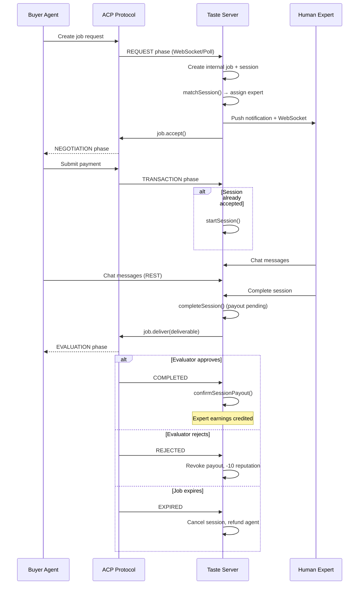
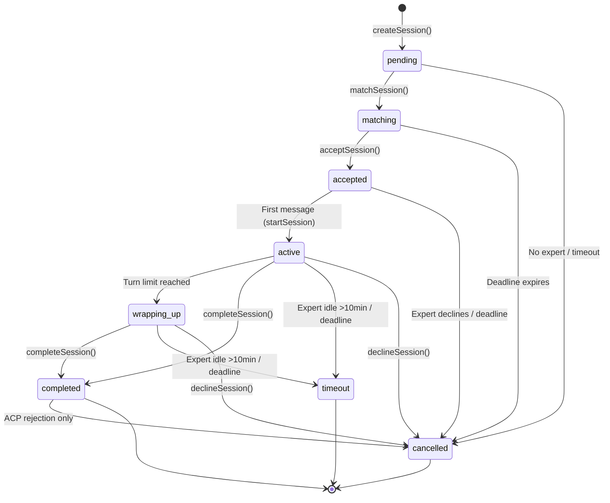
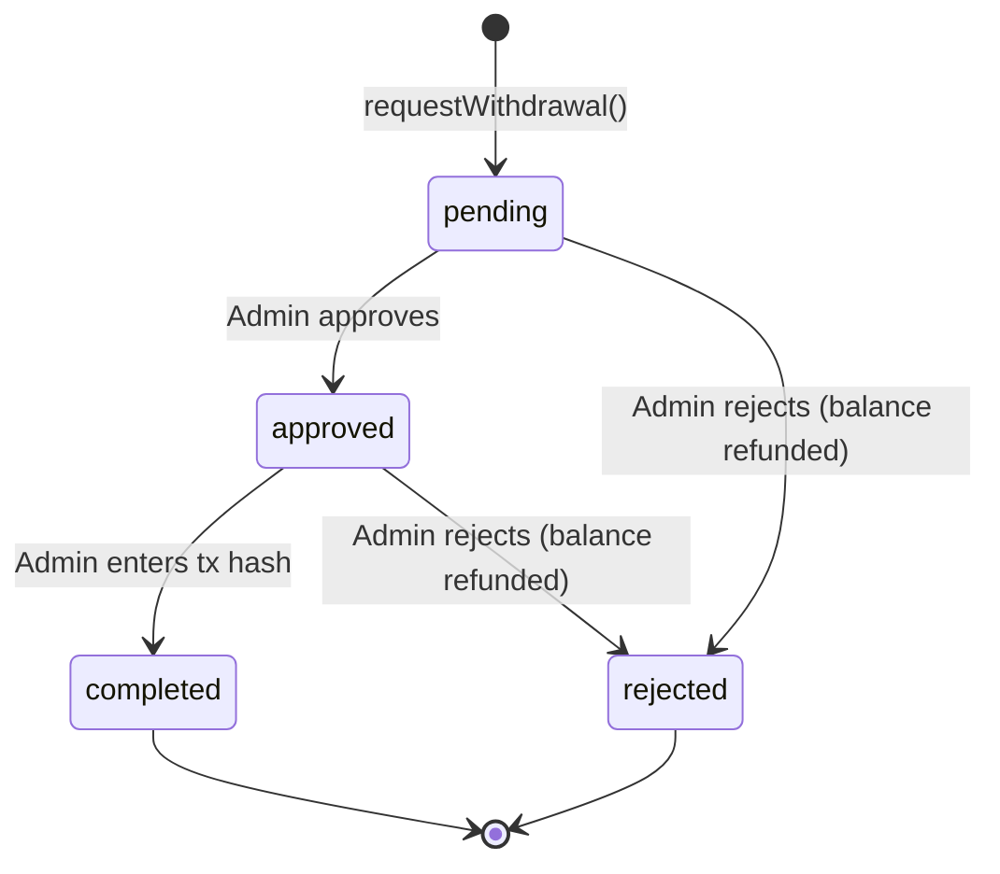

# Taste Platform — Use Cases & Flow Documentation

## System Overview

Taste is an expert marketplace where AI agents pay human experts for qualitative judgments via the ACP (Agent Commerce Protocol). Two delivery modes exist:

- **v1.0 Jobs** — Async one-shot: agent submits request, expert submits structured judgment
- **v1.1 Sessions** — Real-time chat: agent and expert converse in a timed, turn-limited session

---

## 1. ACP Transaction Flow (On-Chain)

The core money flow between a buyer agent and Taste via the Virtuals ACP protocol.

### Phases

```
BUYER AGENT                    ACP (ON-CHAIN)                   TASTE SERVER
    |                               |                               |
    |-- Create job request -------->|                               |
    |                               |-- REQUEST phase ------------->|
    |                               |                               |-- handleNewTask()
    |                               |                               |-- Create internal job + session
    |                               |                               |-- Match expert
    |                               |                               |-- job.accept()
    |                               |<-- NEGOTIATION phase ---------|
    |                               |                               |-- job.createRequirement()
    |                               |                               |
    |-- Submit payment ------------>|                               |
    |                               |-- TRANSACTION phase --------->|
    |                               |                               |-- Start session (if accepted)
    |                               |                               |-- Expert works in chat...
    |                               |                               |
    |                               |                               |-- Session completed
    |                               |                               |-- job.deliver(deliverable)
    |                               |<-- EVALUATION phase ----------|
    |                               |                               |
    |-- Evaluator approves -------->|                               |
    |                               |-- COMPLETED ----------------->|
    |                               |                               |-- confirmSessionPayout()
    |                               |                               |-- Expert earnings credited
    |                               |                               |
    |   OR                          |                               |
    |                               |                               |
    |-- Evaluator rejects --------->|                               |
    |                               |-- REJECTED ------------------>|
    |                               |                               |-- Payout revoked
    |                               |                               |-- Negative reputation (-10)
    |                               |                               |
    |   OR                          |                               |
    |                               |-- EXPIRED ------------------->|
    |                               |                               |-- Session cancelled
    |                               |                               |-- Agent refunded
```

### Key Safety Mechanisms
- Expert earnings are NOT credited until ACP COMPLETED phase (prevents pay-before-delivery)
- `confirmSessionPayout` is idempotent (safe to call from both polling and WebSocket)
- Stuck sessions in TRANSACTION phase are auto-reconciled every 30s
- If session times out or is cancelled, ACP job is rejected and agent is refunded

---

## 2. Real-Time Chat Session Flow (v1.1)

### Status Lifecycle

```
pending → matching → accepted → active → wrapping_up → completed
                                  ↓           ↓            ↓
                               timeout     timeout     cancelled (ACP rejection)
                                  ↓           ↓
                               cancelled   cancelled
```

All transitions are atomic (conditional SQL UPDATE) — prevents race conditions.

### Step-by-Step

```
1. SESSION CREATION
   - Trigger: ACP job arrives OR admin creates manually
   - Action: createSession() → status = 'pending'
   - Sets: tier, offering type, price, deadline, max turns

2. EXPERT MATCHING
   - Trigger: Immediate after creation
   - Action: matchSession() → status = 'matching'
   - Algorithm: Weighted scoring (domain 40%, availability 30%, reputation 20%, load 10%)
   - Skips: Deactivated experts, offline experts, experts without agreement
   - Result: Best expert assigned, notified via WebSocket + push notification

3. EXPERT ACCEPTS
   - Trigger: Expert clicks Accept in dashboard OR socket event
   - Action: acceptSession() → status = 'accepted'
   - Sets: accepted_at, recalculates deadline from now

4. SESSION STARTS
   - Trigger: First non-system message is sent
   - Action: startSession() → status = 'active'
   - Sets: started_at
   - System message: "Session started. The expert is now available."

5. CONVERSATION
   - Agent sends messages via REST API (/sessions/:id/messages)
   - Expert sends messages via WebSocket (message:send) or REST fallback
   - Turn count increments when sender alternates (agent→expert or expert→agent)
   - Same-sender consecutive messages do NOT increment turns
   - Expert idle warning at 5 min, auto-timeout at 10 min (5 min after warning)
   - Idle warning clears when expert sends a message

6. TURN LIMIT
   - When turnCount reaches maxTurns: system notice, limitReached = true
   - Grace period: 5 extra turns (GRACE_TURNS = 5)
   - When turnCount reaches maxTurns + 5: locked = true, no more messages allowed

7. ADD-ONS (during conversation)
   - Agent requests: screenshot, extended_time, written_report, second_opinion, image, follow_up
   - Expert accepts/declines
   - If extended_time accepted: deadline extends by 15 minutes, price increases

8. SESSION COMPLETION
   - Trigger: Expert clicks Complete, or deadline expires
   - Action: completeSession() → status = 'completed'
   - Sets: expert_payout_usdc (price × 0.8 × 0.75)
   - Non-ACP: confirmSessionPayout() immediately (credits earnings + reputation)
   - ACP: Waits for on-chain COMPLETED phase before crediting

9. SESSION TIMEOUT
   - Trigger: Expert idle >10min, or deadline expires on active session
   - Action: timeoutSession() → status = 'timeout'
   - Expert payout = $0, negative reputation (-5)
   - ACP: Job rejected, agent refunded

10. SESSION DECLINE
    - Trigger: Expert clicks "Can't Fulfill"
    - Action: declineSession() → status = 'cancelled'
    - Expert payout = $0, ACP job rejected, agent refunded

11. SESSION CANCELLATION
    - Trigger: No expert available, deadline on pending/matching, admin action
    - Action: cancelSession() → status = 'cancelled'
```

---

## 3. Expert Lifecycle

### Registration & Onboarding

```
1. Admin creates expert account
   - Name, email, password (min 8 chars, upper+lower+number), domains
   - Email encrypted with AES-256-GCM, hash stored for O(1) lookup

2. Expert logs in
   - POST /api/auth/login with email + password
   - Returns JWT in httpOnly cookie (2h expiry)
   - Deactivated accounts blocked

3. Expert accepts agreement
   - POST /api/experts/:id/accept-agreement
   - Required before being matched to sessions

4. Expert sets availability
   - Toggle: online / offline / busy
   - Only 'online' experts are matched to new sessions

5. Expert sets wallet address
   - POST /api/experts/:id/wallet
   - Required for withdrawals (0x + 40 hex chars, Base or Ethereum)
```

### Deactivation

```
- Admin calls DELETE /api/experts/:id
- Sets deactivated_at, forces availability = 'offline'
- Blocked from: login, /auth/me, session matching, withdrawals
- Soft-delete: data preserved for foreign key integrity
- Admin cannot deactivate themselves
```

---

## 4. Withdrawal Flow

```
1. EXPERT REQUESTS
   - POST /api/withdrawals/request { amountUsdc }
   - Validates: not deactivated, wallet set, sufficient balance, ≤$1000/request, ≤$5000/day
   - Atomic: balance check + deduction in single SQLite transaction
   - Status: 'pending'

2. ADMIN REVIEWS
   - GET /api/withdrawals/pending — lists pending withdrawals
   - POST /api/withdrawals/:id/approve → status = 'approved'
   - OR POST /api/withdrawals/:id/reject { reason } → status = 'rejected', balance refunded

3. ADMIN COMPLETES
   - Admin sends USDC on-chain manually
   - POST /api/withdrawals/:id/complete { txHash } → status = 'completed'
   - Requires approved status first

4. REJECTION REFUND
   - If rejected: earnings_usdc atomically refunded in same transaction
```

---

## 5. v1.0 Job Flow (Legacy Async)

```
1. ACP job arrives → createJob()
2. Auto-assigned to best expert by domain/reputation
3. Expert submits structured judgment via dashboard form
4. Prohibited language check (financial advice terms)
5. Judgment formatted as deliverable
6. Delivered to ACP
7. Expert earnings credited immediately (v1.0 does not wait for ACP confirmation)
```

---

## 6. Reputation System

```
Events and score changes:
  job_completed   → +2
  positive_feedback → +5
  timeout         → -5
  rejected        → -10

Score range: 0–100 (clamped)
Initial score: 50 per domain
Affects: Expert matching priority (20% weight in scoring algorithm)
```

---

## 7. Push Notifications

```
Triggers:
  - New session matched to expert → "New Session Request"
  - Agent sends message → "New Message" (with content preview)
  - Add-on requested → "Add-on Requested"

Delivery: Web Push via VAPID keys
Cleanup: Stale subscriptions (410/404) auto-removed
```

---

## 8. Admin Use Cases

```
1. Create expert accounts (name, email, password, domains)
2. View all experts with status, domains, completed jobs
3. Deactivate experts (soft-delete)
4. Create test sessions manually
5. View all sessions (active, pending, completed)
6. Approve/reject/complete withdrawals
7. Send messages as agent (for testing)
```

---

## Mermaid Diagrams

### ACP Transaction Flow



### Session Lifecycle



### Withdrawal Flow


